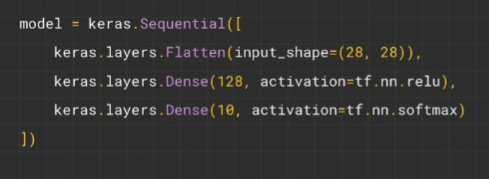
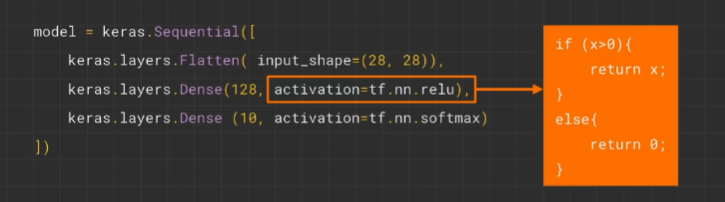
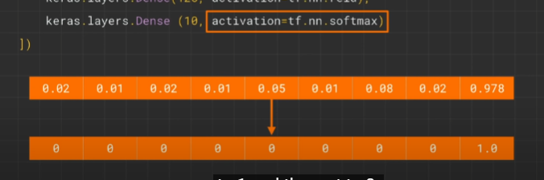
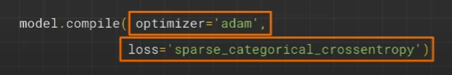
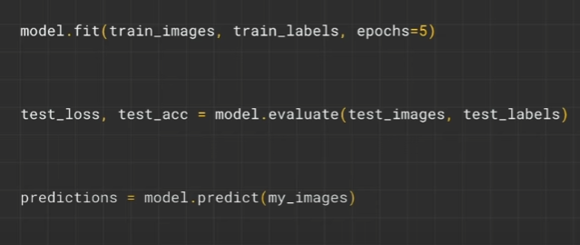
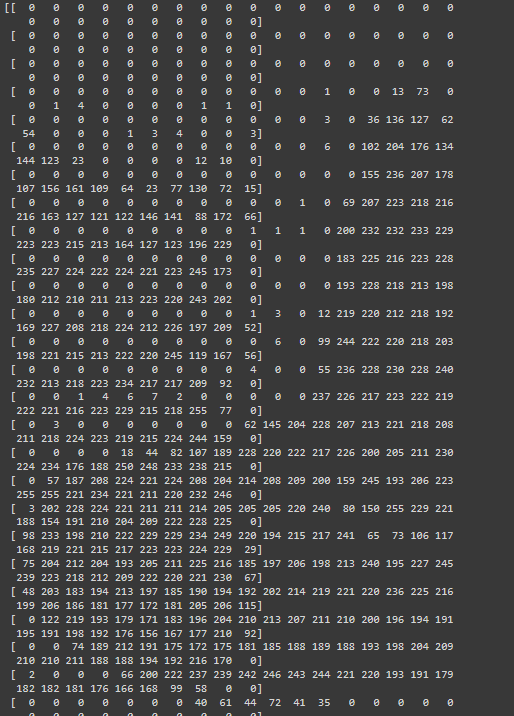
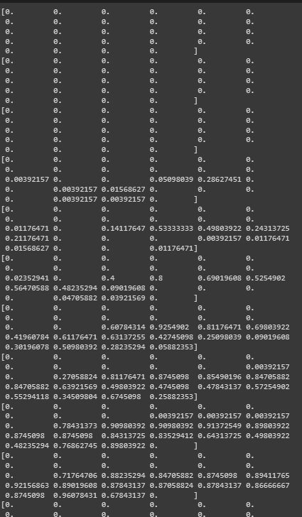

## Review from intro

This pattern will be apparent in other sophisticated aspects:

Creating neural network, compiling it with a loss function along with its optimizer, and then fiting data to labels

## Computer vision

Labeled Images! Looks at the Pixels

### Data Set Helper -> Fashion MNIST

E.g. -
train_X, train_Y, test_X, test_Y = fashion_mnist.load_data()

train_X = Train IMG, train_Y = Train Labels(0-9)

- Numbers because computers understand numbers better, and doing it as a string, it would introduce a bias and the neural
  network wuold try to decipher the meaning in English. Therefore, for labeling, it is best to use numbers

Training VS Testing E.g. -
60k from 70k -> Train the Neural Network
10k from 70k -> Test the Neural Network



Before we had one layer and one neuron, now we have three layers.

- .Flatten() -> No Neurons here, but its functionality is to get a 28 by 28 image (data) and flatten that to one dimensional array so it can be processed by the next layer
- .Dense() -> Next layer has 128 neurons
- .Dense() -> Next layer has 10 neurons in it

- Theres 10 neurons at the end because its job is to calculate the probability that a piece of clothing is for that particular class

** Remember, all data being fed into the training has to be the same size **




----> deeplearning.ai (andrew) --> under the hood neural networks



- test_loss, test_accuracy = model.evaluate(test_X, test_Y) can pass in a list of data which is different from model.predict() where it only gets a single value
  

Neural Networks work best with values from 0 - 1
Therefore, we have to go through a process called **normalizing**
which essentialy gets all training images and testing images and divides them by 255.0

Why do we need to do this? Well look at this

```py
Epoch 1/5
1875/1875 [==============================] - 17s 9ms/step - loss: 5.6505
Epoch 2/5
1875/1875 [==============================] - 15s 8ms/step - loss: 0.5513
Epoch 3/5
1875/1875 [==============================] - 15s 8ms/step - loss: 0.5094
Epoch 4/5
1875/1875 [==============================] - 15s 8ms/step - loss: 0.5007
Epoch 5/5
1875/1875 [==============================] - 15s 8ms/step - loss: 0.4898
313/313 [==============================] - 2s 5ms/step - loss: 0.6163
```

In the normalization factor, since I didnt normalize it, the gradient (which is the one in charge of like or tells us what direction to go in inorder to recieve a reduced loss) goes everywhere. The direction is unclear which results in bouncing numbers in loss.

Lets take a look again.

This can be the reuslt of our first training image



Dividing by 255 gets us the following



```
Sequential: That defines a SEQUENCE of layers in the neural network

Flatten: Remember earlier where our images were a square, when you printed them out? Flatten just takes that square and turns it into a 1 dimensional set.

Dense: Adds a layer of neurons

Each layer of neurons need an activation function to tell them what to do. There's lots of options, but just use these for now.

Relu effectively means "If X>0 return X, else return 0" -- so what it does it it only passes values 0 or greater to the next layer in the network.

Softmax takes a set of values, and effectively picks the biggest one, so, for example, if the output of the last layer looks like [0.1, 0.1, 0.05, 0.1, 9.5, 0.1, 0.05, 0.05, 0.05], it saves you from fishing through it looking for the biggest value, and turns it into [0,0,0,0,1,0,0,0,0] -- The goal is to save a lot of coding!
```

- Adding more Neurons we have to do more calculations, slowing down the process, but in this case they have a good impact -- we do get more accurate. That doesn't mean it's always a case of 'more is better', you can hit the law of diminishing returns very quickly!

- What would happen if you remove the Flatten() layer. Why do you think that's the case? You get an error about the shape of the data. It may seem vague right now, but it reinforces the rule of thumb that the first layer in your network should be the same shape as your data. Right now our data is 28x28 images, and 28 layers of 28 neurons would be infeasible, so it makes more sense to 'flatten' that 28,28 into a 784x1. Instead of wriitng all the code to handle that ourselves, we add the Flatten() layer at the begining, and when the arrays are loaded into the model later, they'll automatically be flattened for us.

- Another rule of thumb -- the number of neurons in the last layer should match the number of classes you are classifying for. In this case it's the digits 0-9, so there are 10 of them, hence you should have 10 neurons in your final layer.

- Adding more layers for our neurons is not necessarily going to create a bigger impact as this is relatively simple data and the outcome we want is relatively simple. However, for more complex ideas, more layers are require ( Will learn about this tomorrow )

Adding more epoch can result in overfitting (you might see the loss value stops decreasing, and sometimes increase) Should make sur eto keep an eye out for this when training my neural network. If the loss isnt improving then tehres no point in contionously training my model.

## Callbacks

If we wanted the model to stop at 95% accuracy, that is possible with a simple function. There exists an accuracy in the logs, so once it runs a couple of times in the epoch or whatever, and the metrics (accuracy) become over 0.9, we can stop training the model.

```py

class myCallback(tf.keras.callbacks.Callback):
  def on_epoch_end(self, epoch, logs={}): # This is specfic to the Callback module
    if(logs.get('accuracy')>0.9):
      print("\nReached 90% accuracy so cancelling training!")
      self.model.stop_training = True
```

```py
model.compile(optimizer='adam', loss='sparse_categorical_crossentropy', metrics=['accuracy'])
model.fit(training_images, training_labels, epochs=5, callbacks=[callbacks])
```

These are what the accuracy looks like for each epoch:

```
2.12.0
Epoch 1/5
1875/1875 [==============================] - 16s 8ms/step - loss: 0.4746 - accuracy: 0.8288
Epoch 2/5
1875/1875 [==============================] - 16s 8ms/step - loss: 0.3579 - accuracy: 0.8694
Epoch 3/5
1182/1875 [=================>............] - ETA: 5s - loss: 0.3245 - accuracy: 0.8826
```

## Lab

```py
# https://colab.research.google.com/github/lmoroney/mlday-tokyo/blob/master/Lab2-Computer-Vision.ipynb


# YOUR CODE SHOULD START HERE
# YOUR CODE SHOULD END HERE
import tensorflow as tf
mnist = tf.keras.datasets.mnist

class callBack(tf.keras.callbacks.Callback):
  def on_epoch_end(self,epoch, logs={}): # Specific function call using tensorflow callbacks module
    if (logs.get("accuracy")>=0.99):
      self.model.stop_training = True

callbacks = callBack()
(x_train, y_train),(x_test, y_test) = mnist.load_data()
# YOUR CODE SHOULD START HERE
x_train = x_train / 255
x_test = x_test / 255
# YOUR CODE SHOULD END HERE
model = tf.keras.models.Sequential([
    tf.keras.layers.Flatten(),
    tf.keras.layers.Dense(320, activation=tf.nn.relu),
    tf.keras.layers.Dense(10, activation=tf.nn.softmax)
# YOUR CODE SHOULD START HERE


# YOUR CODE SHOULD END HERE
])

model.compile(optimizer='adam',
              loss='sparse_categorical_crossentropy',
              metrics=['accuracy'])

# YOUR CODE SHOULD START HERE

model.fit(x_train, y_train, epochs=10, callbacks=[callbacks])
# YOUR CODE SHOULD END HERE
```

Results ->

```
Epoch 1/10
1875/1875 [==============================] - 6s 3ms/step - loss: 0.2181 - accuracy: 0.9351
Epoch 2/10
1875/1875 [==============================] - 6s 3ms/step - loss: 0.0884 - accuracy: 0.9729
Epoch 3/10
1875/1875 [==============================] - 5s 3ms/step - loss: 0.0590 - accuracy: 0.9819
Epoch 4/10
1875/1875 [==============================] - 6s 3ms/step - loss: 0.0411 - accuracy: 0.9871
Epoch 5/10
1875/1875 [==============================] - 5s 3ms/step - loss: 0.0296 - accuracy: 0.9906
<keras.callbacks.History at 0x7f115e5e5570>
```
