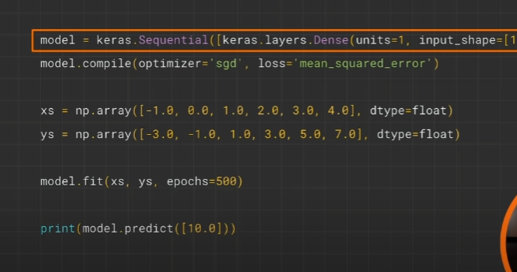
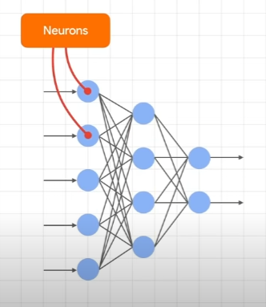
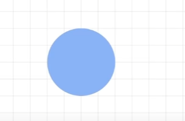
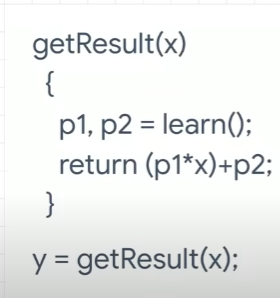

## Intro to Machine Learning

Before-
Rules + Data ==> Traditional Programming ==> Answer

After-
Answers + Data ==> Traditional Programming ==> Rules

E.g.

- In the example of a activity recognition smartwatch, you
  can have instances of data where you show what walking, running, and even sprinting instances

10101010010010 -> walking
00011101011110 -> running
10111101110000 -> sprinting

Patterns <--> Labels

Having lots of data + labels, and then programming the computer for
your desired output

E.g.
X = -1 0 1 2 3 4
Y = -3 -1 1 3 5 7

When x = -1 y = -3

Pattern -> Every +1 increase in X results in a +2 increase in Y

In other words Y = 2x-1
This is how **Neural Networks** work




Keras -> Framework within Tensorflow to make ML models easier to work with
Sequential -> Define sequence of layers
Dense -> Where every neuron connects to eachother
Units -> 1 neuron in our only 1 layer
E.g. -


The Neural Network has no idea what the relationship is between the data and the labels
So, it makes a guess

Loss -> How good or bad the guess is
Optimizer -> Will optimize the results to get a better prediction and lower the loss

.fit -> Tell the model from the xs to the ys and do it 500 times

Epochs -> The amount of times (similar to a loop)

.predict -> When the machine is done learning you can then predict it with a X List

---

Since were only given limited data, it will likely have a different response everytime

Neural Networks deal with **probability**

A Neuron sort of works like this where it has the parameters and learns those parameters overtime from the data. This will then give the results


- sgd => Stograstic Gradient Descent
- lab

```py
# https://colab.research.google.com/github/lmoroney/dlaicourse/blob/master/Exercises/Exercise%201%20-%20House%20Prices/Exercise_1_House_Prices_Question.ipynb#scrollTo=mw2VBrBcgvGa

# So, imagine if house pricing was as easy as a house costs 50k + 50k per bedroom, so that a 1 bedroom house costs 100k, a 2 bedroom house costs 150k etc.

# How would you create a neural network that learns this relationship so that it would predict a 7 bedroom house as costing close to 400k etc.

import tensorflow as tf
import numpy as np
from tensorflow import keras
model = tf.keras.Sequential([keras.layers.Dense(units=1, input_shape=[1])])
model.compile(optimizer="sgd", loss="mean_squared_error")
xs = np.array([1,2,3,4,5,6,7,8], dtype="float")
ys = np.array([100, 150, 200, 250, 300, 350, 400, 450],dtype="float")
model.fit(xs, ys, epochs=300)
print(model.predict([7.0]))
```

So, let's break down the code step by step:

1. Imports: The initial lines of code import the necessary libraries for building and training the neural network model. TensorFlow (tf) is a popular deep learning framework, and Keras is a user-friendly API for building neural networks.

2. Model Initialization: The line `model = tf.keras.Sequential([keras.layers.Dense(units=1, input_shape=[1])])` sets up the neural network model. `Sequential` is used to define a sequence of layers. In this case, we have a single layer defined by `Dense`, which represents a fully connected layer. The `units=1` indicates that the layer has one neuron, and `input_shape=[1]` specifies that the input to the model is one-dimensional.

3. Model Compilation: After defining the model, we compile it using `model.compile(optimizer="sgd", loss="mean_squared_error")`. Here, we specify the optimizer as Stochastic Gradient Descent (SGD), which is a popular optimization algorithm. The loss function chosen is Mean Squared Error (MSE), which measures the difference between the predicted values and the true values. The goal is to minimize this difference during training.

4. Data Preparation: The next step involves preparing the data for training. `xs` represents the input data, which is the number of bedrooms in the house. `ys` represents the corresponding output data, which is the expected price of the house. These arrays are created using NumPy, a library for numerical computations.

5. Model Training: With the data prepared, we train the model using `model.fit(xs, ys, epochs=300)`. This trains the neural network by adjusting its internal parameters to minimize the loss. The training is performed for 300 epochs, meaning the entire dataset is passed through the model 300 times.

6. Prediction: Finally, we make predictions using `print(model.predict([7.0]))`. The model predicts the price for a 7-bedroom house based on what it has learned during training.

In summary, this code demonstrates a simple neural network that learns the relationship between the number of bedrooms and the corresponding house prices. By providing input data (number of bedrooms) and output data (house prices), the model learns to predict the price for unseen examples. The training process iteratively adjusts the model's internal parameters to minimize the difference between predicted and actual prices."
