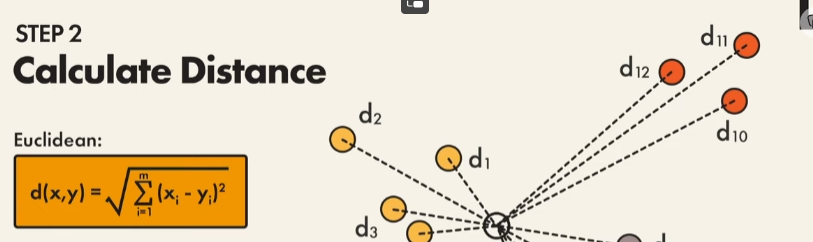
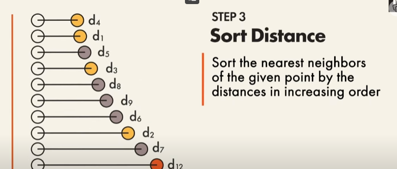

## KNN

### how it can work for mine

the X input will be the text exampels and then y will contian values from 0 - 3 for example (theres going to be more)

```py

X = ["Potato", "Super long text about history", "I dont understand why tiktok is weird.", "Super long other text"]
y = [0, 1, 2, 3]

```

and my dictionary looks something like this

```py
temp = {
    0: "food",
    1: "history",
    2: "media",
    3: "other"
}
```

first what i have to do is give numerical values for X, right?
assuming i recieved the text from the pdf i have to remove all stop words + punctuation

now i can give numerical values. theres two way to do this

1. bag of words -> vector representation where each elemetn corresponds to the frequency of a word within th edocument
2. tf-dif -> assigns words based on thier frequency (importanec words)

then i can split my data into traiing and testing

i train the model by doing the following
lets say this is what my X and y's look like

```py
X_train = [3.53, 1.56, 2.22, 0.31, 2.45]
y_train = [0, 1, 2, 2, 3]
```

now what i can do is apply the euclidean distanec between what i want to test versus what its learned

```
the square root of (x1 - x2) ^ 2 plus (y1 - y2) ^ 2
where x is our test input and y is the training output
```

more i think about it i can just subtract the two distances so i dont need traditional x and y
we only needto subtract the distances between the two
then what we can do is append those distances to a list

we an choose lke 2 to 3 neighbors and comparetheir values and whatevers the most prevelant is the winner!!

also keep in mind these are vectors not numbers, im just giving an idea

we essentially do this with every pint from our testing data

e.g.

lets assume our user inputs their pdf and they recieve something like this
X = [2.11]

so then we test with each point

1. 3.53 - 2.11 = 1.42
2. 1.56 - 2.11 = - bla bla
3. 2.22 - 2.11 = .01
   and so one

we then can see that 2.22 is the closest right? bc the difference is .01
therefore we can assume that the users document is going to return the label 2.

in our dictionary, that value is "media" so then the persons pdf will be placed in `textboost/media`

---

sklearns.neighbors -> provides functionality fo rboth unsupervised and supervised learning

supervised neighbors -> classification and regression

principle -> find the number of training samples closest in distance to the new point and then perdict the label from that

number of samples -> can be user defined or based on local density of pints (radius based neighbor learning)

distance -> cna be any metri measure, most common was is **euclidean disnace**

k nearest neighbor have been successful in several classification and regression problems

- sklearn.neighbors handle numpy lists

- 
  
